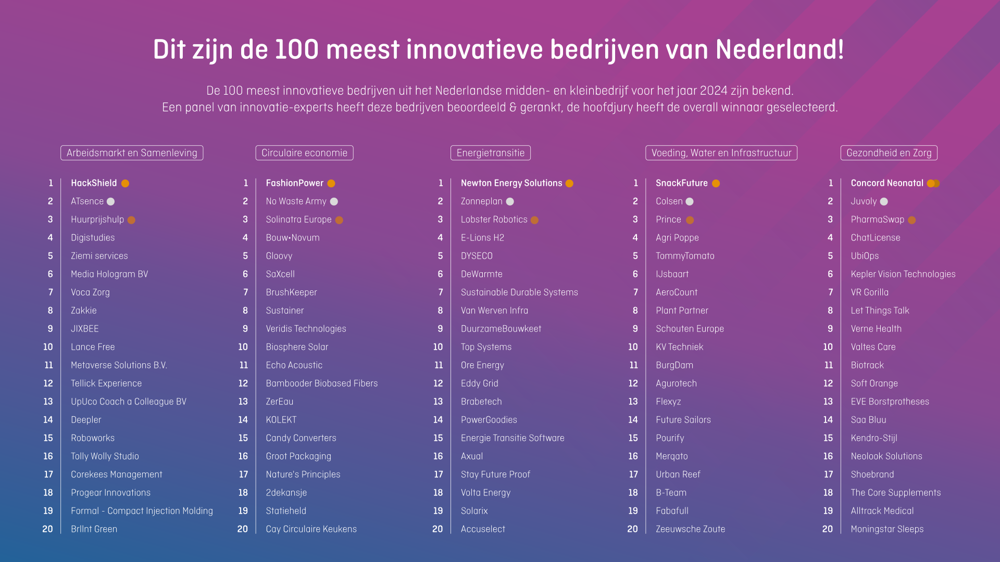

<!-- _class: cover -->
<!-- _paginate: false -->

INSPELEN OP INNOVATIES · LES 2

# Van idee

# naar innovatie.

Laat je inspireren door innovaties en Internet of Things.
Beschrijf, teken en ontwerp jouw idee op één poster.

**Pascal Thong** · Inspelen op innovaties

---

TERUGBLIK OP INNOVATIES

## Besproken innovaties

- **Waterstof**
- **Python**
- **DLSS** · AI en framegeneratie voor gaming
- **AI-tools**
- **AirPods**
- **Zelfrijdende auto**
- **Bullet train** · hogesnelheidstrein

> Welke innovaties hebben met ons vakgebied te maken?
> Wat heb je met de innovaties gedaan?

---

<!-- _class: action -->

DE CENTRALE OPDRACHT VAN DE LES

## Ontwerp een innovatieve uitvinding.

**Beschrijf, teken en ontwerp jouw uitvinding op één poster.**

1. **Probleem en doelgroep:** voor wie maak je iets en waarom?
2. **Jouw oplossing:** wat doet de uitvinding en wat is er nieuw aan?
3. **Tekening of ontwerp:** laat de onderdelen en de werking zien.
4. **Techniek:** wat heb je nodig? Denk aan sensoren, software of internet.

> Geef je uitvinding een naam.
> Maak je idee begrijpelijk met teksten en beeld.

---

WAT IS INTERNET OF THINGS?

## Internet of Things.

**Internet of Things (IoT)** verbindt fysieke apparaten met internet.
Ze kunnen metingen doorgeven, op afstand worden bediend of automatisch reageren.

[Bekijk de video: wat is Internet of Things?](https://www.youtube.com/watch?v=pF98lsa-tX0)

**Kijkvraag:**

> Waar irriteer jij je aan?
> En hoe kunnen we dit oplossen?

---

<!-- _class: sensors -->

BESCHIKBARE SENSOREN · VERKENNING

## Voorbeelden

| Sensor                  | Meet of detecteert | Voorbeeldtoepassing                     |
| ----------------------- | ------------------ | --------------------------------------- |
| Temperatuursensor       | Temperatuur        | Melding als een ruimte te warm is       |
| Luchtvochtigheidssensor | Vocht in de lucht  | Klimaat in een kas volgen               |
| Lichtsensor             | Hoeveelheid licht  | Verlichting regelen bij duisternis      |
| Bodemvochtsensor        | Vocht in de grond  | Melding als een plant water nodig heeft |

---

<!-- _class: sensors -->

BESCHIKBARE SENSOREN · VERKENNING

## nog meer voorbeelden

| Sensor                | Meet of detecteert          | Voorbeeldtoepassing                |
| --------------------- | --------------------------- | ---------------------------------- |
| Bewegingssensor (PIR) | Beweging van een warmtebron | Melding bij beweging in een ruimte |
| Afstandssensor        | Afstand tot een object      | Vulling van een prullenbak volgen  |
| Magneetcontact        | Open of gesloten            | Melding als een deur openstaat     |
| Waterleksensor        | Aanwezigheid van water      | Waarschuwing bij een lekkage       |

---

VOORBEELDEN VAN IoT-PROJECTEN

## Van meting naar een handige toepassing

- **[Slimme plantenverzorging](https://docs.arduino.cc/hardware/plant-watering-kit)**\
  Meet bodemvocht en geef planten op afstand water via Arduino Cloud.
- **[Weerstation met Arduino Cloud](https://projecthub.arduino.cc/dbeamonte_arduino/weather-station-with-arduino-cloud-20ce95)**\
  Verzamel weergegevens en bekijk ze via een online dashboard.
- **[Slimme wekker](https://projecthub.arduino.cc/MoritzDornseifer/iot-cloud-enabled-alarm-clock-4d0c9d)**\
  Stel de wektijd via internet in met Arduino Cloud.

**Bespreek:** welk probleem lost dit op? Wat zou jij toevoegen of verbeteren?

---

<!-- _class: statement -->

VAN INSPIRATIE NAAR EEN EIGEN IDEE

## Wie heeft er nu een eigen idee?

Vertel kort: **voor wie**, **welk probleem** en **jouw oplossing**.

Welke techniek of sensor zou jouw idee mogelijk maken?

---

<!-- _class: action -->

OPDRACHT · HERHALING

## Jouw uitvinding op één poster

**Beschrijf, teken en ontwerp een innovatieve uitvinding.**

- Geef je uitvinding een **naam**.
- Beschrijf het **probleem en de doelgroep**.
- Leg uit **wat jouw oplossing doet en wat er vernieuwend aan is**.
- Maak een **duidelijke tekening** met onderdelen en hun werking.
- Benoem de **benodigde techniek** en eventueel sensoren en internet.

Begin met een schets. Werk die uit tot één overzichtelijke poster.

---

NOG GEEN idee?

## Maak een poster over een innovatief bedrijf.

Kies een bedrijf uit de tabel op de volgende dia en onderzoek één innovatie van dat bedrijf.

Zet op **één innovatieposter**:

- De **naam van het bedrijf** en wat het doet.
- Een **innovatie**: wat is er nieuw of verbeterd?
- Het **probleem** dat de innovatie oplost en **voor wie**.
- Een **afbeelding of tekening** die de werking verduidelijkt.
- De **bronnen** die je hebt gebruikt, met links.

---

<!-- _paginate: false -->

<!-- Kies een innovatief bedrijf uit de tabel voor de alternatieve posteropdracht. -->
