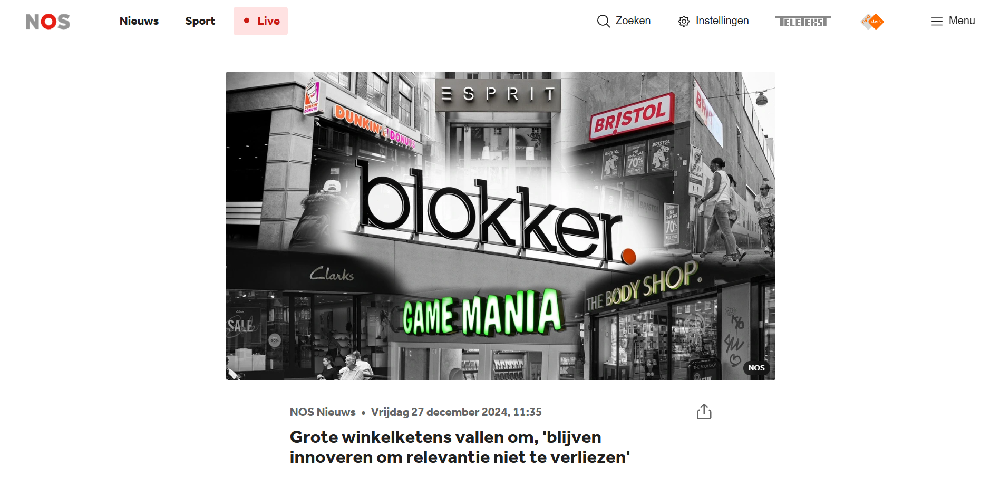
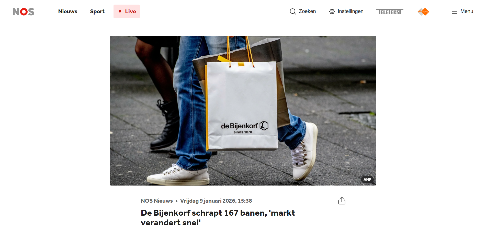
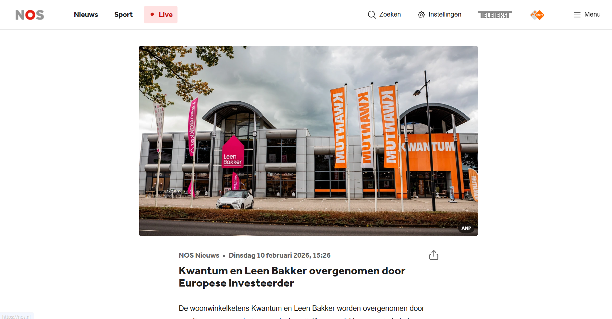
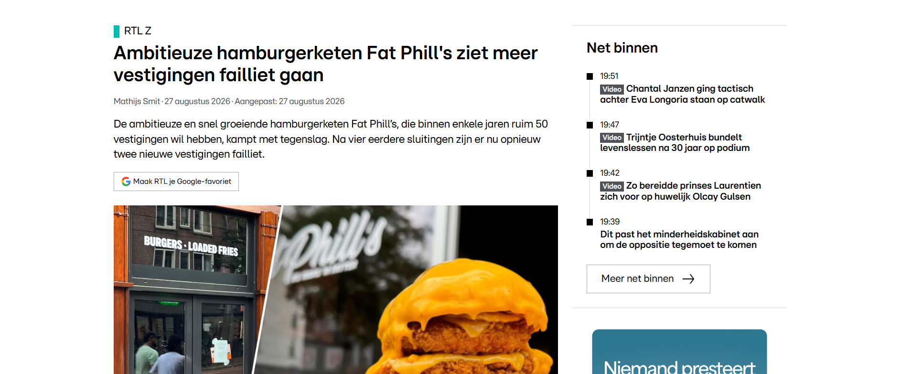

<!-- _class: cover -->
<!-- _paginate: false -->

INNOVATIE & VERANDERING

# De branche verandert.

# Jij beweegt mee.

Onderzoek wat er verandert. Ontdek wat het betekent.
Zet nieuwe inzichten om in actie.

**Pascal Thong** · Inspelen op innovaties

---

<!-- _class: roadmap -->

DE ROUTE

## Van onderzoek naar impact

1. **Signaleren** — Pitch Presentatie
2. **Onderzoeken** — Poster van een idee
3. **Vertalen** — E-mail met een innovatievoorstel
4. **Ontwikkelen**
5. **Kiezen**
6. **Doen**
7. **Delen**

---

# Planning van vandaag

## Twee uur aan de slag

| Tijd  | Onderdeel             | Wat ga je doen? |
| ----- | --------------------- | --------------- |
| 1 UUR | **All you can learn** |
| 1 UUR | **Casus uitwerken**   |

---

<!-- _class: bedrijven -->

DE BRANCHE VERANDERT

## Welke bedrijven herken jij?

- Dunkin' Donuts
- Esprit
- Bristol
- Blokker
- Game Mania
- The Body Shop
- Clarks
- de Bijenkorf
- Kwantum
- Leen Bakker
- Fat Phill's

**Bespreek:** waarom moeten deze bedrijven blijven vernieuwen?

---

<!-- _class: nieuws -->
<!-- _paginate: false -->

---

<!-- _class: nieuws -->
<!-- _paginate: false -->

---

<!-- _class: nieuws -->
<!-- _paginate: false -->

---

<!-- _class: nieuws -->
<!-- _paginate: false -->

---

<!-- _class: directiemail -->

FICTIEVE CASUS · BERICHT VAN DE DIRECTEUR

## Onderwerp: help ons bedrijf vooruit

> **Van:** de directeur van jouw gekozen bedrijf  
> **Aan:** alle medewerkers  
> **Onderwerp:** dringend gezocht: jullie ideeën voor innovatie

Beste collega's,

Ons bedrijf staat op de rand van een faillissement. Klanten kiezen vaker voor andere aanbieders en onze kosten zijn te hoog. We moeten ons bedrijf vernieuwen om te overleven.

Er is nog **€ 100.000 beschikbaar om te innoveren**. Als we **niet binnen twee jaar winstgevend zijn**, wordt ons bedrijf failliet verklaard.

Daarom vraag ik alle medewerkers om hulp. Welke **bedreigingen** zien jullie? Welke **kansen** bieden veranderingen in onze branche? Jullie kennen onze klanten en het dagelijkse werk.

Stuur mij een **concreet innovatievoorstel**. Leg uit wat we moeten veranderen, wat dit kost en hoe jouw idee ons binnen twee jaar weer winstgevend kan maken.

Met vriendelijke groet,

Lin Soerdjbalie
De directeur

---

<!-- _class: action innovatieopdracht -->

OPDRACHT VAN VANDAAG

## Schrijf een e-mail aan de directeur

Kies **één bedrijf van de bedrijvenslide**. Jij bent medewerker en beantwoordt de fictieve oproep met een **innovatievoorstel van minimaal 500 woorden**.

1. **Situatie:** beschrijf het bedrijf, de doelgroep en het probleem.
2. **Bedreigingen en kansen:** benoem minimaal twee van elk. Koppel ze aan ontwikkelingen in de branche en gebruik betrouwbare bronnen.
3. **Innovatie:** werk één idee uit. Wat vernieuw je, voor wie en waarom helpt dit het bedrijf?
4. **Budget en aanpak:** verdeel maximaal **€ 100.000** over concrete kostenposten. Beschrijf de stappen voor de komende **twee jaar**.
5. **Resultaat:** onderbouw hoe je idee tot winst leidt, welke risico's er zijn en hoe je het succes meet. Maak je aannames duidelijk.

Lever in **mail-klad.docx**: een zelfgetypte e-mail met onderwerp, aanhef, afsluiting.
Lever in **mail-ai.docx**: een zakelijke e-mail

---

<!-- _class: cover -->
<!-- _paginate: false -->

JOUW VOLGENDE STAP

# Welke verandering

# ga jij verder onderzoeken?

Begin bij je vak. Stel een goede vraag. Ga op onderzoek uit.
