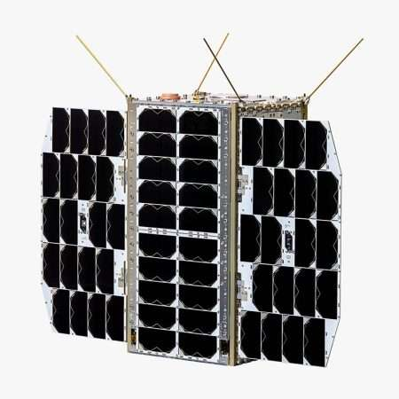

<!-- _class: cover -->
<!-- _paginate: false -->

INSPELEN OP INNOVATIE

# Ik ben Pascal Thong.

# Met Indonesische roots.

Mijn innovatiepitch: **een compacte server in de ruimte.**

<!--
Spreektekst · circa 15 seconden
Ik ben Pascal Thong en ik heb Indonesische roots. Vandaag neem ik jullie mee naar een plek waar je misschien niet direct aan denkt bij servers: de ruimte. Mijn idee draait om een kleine satelliet met rekenkracht aan boord.
-->

---

DE INNOVATIE · CUBESAT

## Een kleine satelliet.
## Een compacte server aan boord.

Een **CubeSat** is een kleine satelliet, opgebouwd uit standaardmodules.
Eén basismodule is ongeveer **10 × 10 × 10 centimeter**.

Mijn idee: een CubeSat met een compacte computer die we de ruimte in kunnen sturen om **gegevens op te slaan en te verwerken**.

> De CubeSat is het ruimtevaartuig. De boordcomputer vervult de serverfunctie.

<!--
Spreektekst · circa 25 seconden
Een CubeSat is een kleine satelliet, opgebouwd uit standaardmodules. Eén basismodule is ongeveer tien bij tien bij tien centimeter. Daarin kunnen we een compacte computer meenemen. Zie het als een kleine server die gegevens opslaat en verwerkt, maar dan speciaal ontworpen voor gebruik in de ruimte.
Bron: https://esto.nasa.gov/cubesat-on-board-processing-validation-experiment/
-->

---

DE KANS · REKENEN WAAR DE DATA ONTSTAAN

## Eerst verwerken. Dan versturen.

**Sensoren → boordcomputer → relevante resultaten naar de aarde**

- Metingen al **in de satelliet analyseren**.
- Alleen geselecteerde resultaten doorsturen: **minder dataverkeer**.
- Toepassingen onderzoeken, zoals het herkennen van veranderingen in landbouwgebieden.

Het vernieuwende zit in **slimme dataverwerking aan boord**.

<!--
Spreektekst · circa 25 seconden
Het interessante is dat de satelliet gegevens zelf kan verwerken. In plaats van alle ruwe data naar de aarde te sturen, selecteert de computer wat relevant is. Een mogelijke toepassing die ik wil onderzoeken, is het herkennen van veranderingen in landbouwgebieden. Zo brengen we de rekenkracht naar de plek waar de data ontstaan.
Bron: https://www.jpl.nasa.gov/missions/m-cubed-cove-2/
-->

---

<!-- _class: action -->

MIJN VOLGENDE STAP

## Groot denken.
## Klein beginnen.

Dit spreekt mij aan omdat **ICT en ruimtevaart samenkomen**.

Eerst op aarde een prototype bouwen dat sensordata verwerkt.
Daarna onderzoeken wat nodig is voor **stroomvoorziening, warmteafvoer en bescherming tegen straling**.

> Mijn pitch: laten we een compacte server bouwen die klaar kan worden gemaakt voor de ruimte.

<!--
Spreektekst · circa 25 seconden
Ik kies dit onderwerp omdat ICT en ruimtevaart hier samenkomen. Ik wil klein beginnen: op aarde een prototype bouwen dat sensordata verwerkt. Voor een echte ruimtemissie moeten we vervolgens rekening houden met stroom, warmte en straling. Voor mij is inspelen op innovatie: een groot idee vertalen naar een eerste test die we echt kunnen uitvoeren.
Totale spreektijd: circa 90 seconden.

Bronnen ter voorbereiding:
- NASA, CubeSat On-Board processing Validation Experiment: https://esto.nasa.gov/cubesat-on-board-processing-validation-experiment/
- NASA JPL, M-Cubed/COVE-2: https://www.jpl.nasa.gov/missions/m-cubed-cove-2/
- NASA, Small Spacecraft Avionics: https://www.nasa.gov/smallsat-institute/sst-soa/small-spacecraft-avionics/
-->
