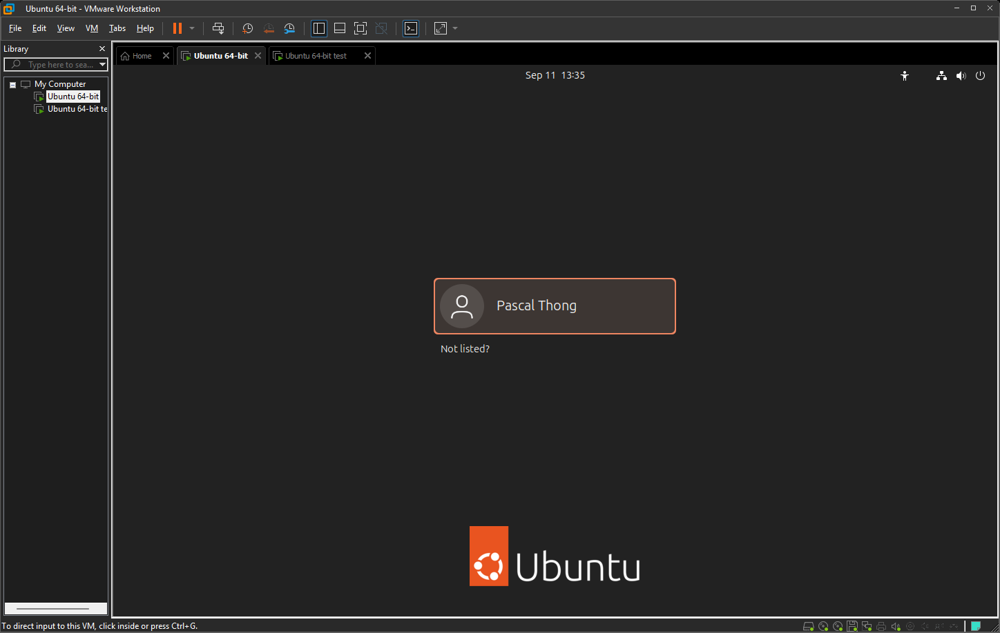
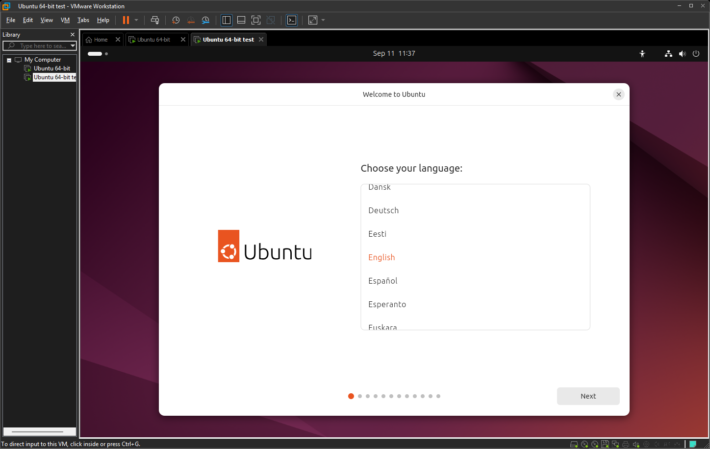
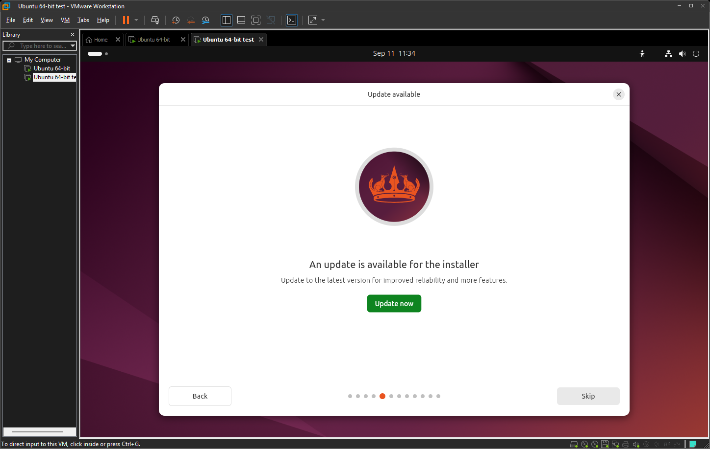
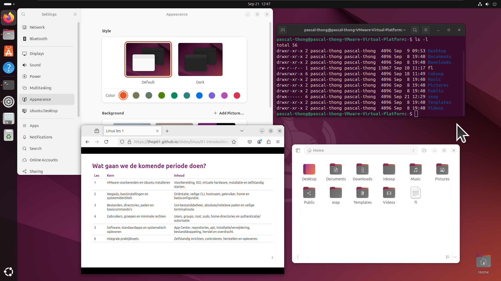
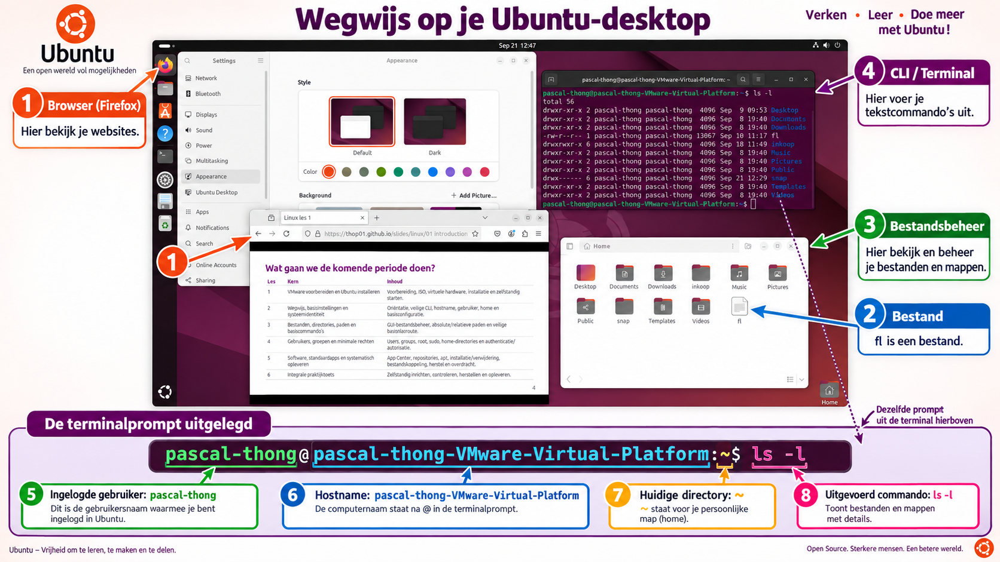
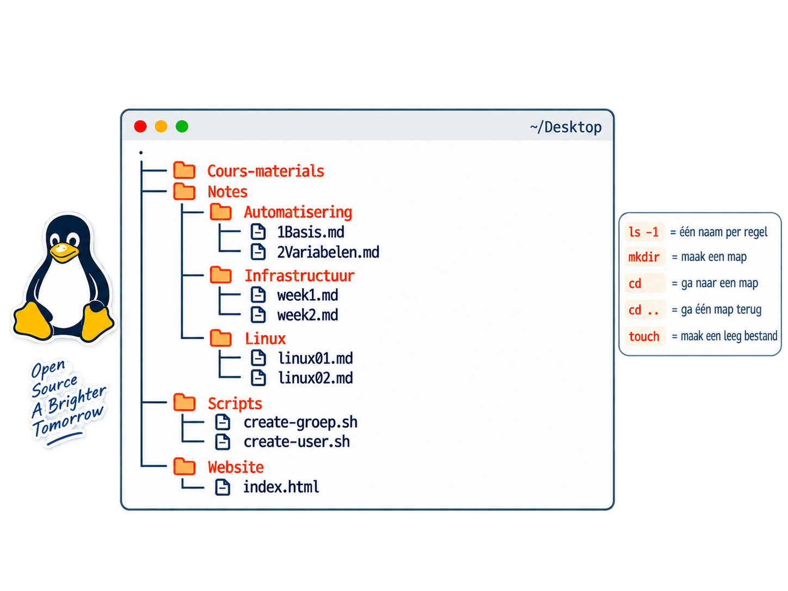

<!-- Kopieer dit bestand voor een nieuwe les en vervang de voorbeeldinhoud.
Elke --- begint een nieuwe dia. _class geldt alleen voor de huidige dia.
Opmaak staat in ../theme/ubuntu.css; inline CSS is niet nodig.
Afbeeldingspaden zijn relatief aan dit Markdown-bestand. -->

<!-- _class: title -->
<!-- _paginate: false -->

# Linux: Orientatie

Les 02 - Wegwijs, basisinstellingen en systeemidentiteit.

---

# Overzicht

<style scoped>
table { width: 100%; table-layout: fixed; font-size: 20px; line-height: 1.3; border-collapse: collapse; }
th, td { padding: 9px 12px; text-align: left; vertical-align: top; border-bottom: 1px solid #dedede; }
th { color: #77216f; }
th:first-child, td:first-child { width: 5%; }
th:nth-child(2), td:nth-child(2) { width: 35%; }
</style>

| Les | Kern                                              | Inhoud                                                                                             |
| --- | ------------------------------------------------- | -------------------------------------------------------------------------------------------------- |
| 1   | VMware voorbereiden en Ubuntu installeren         | Voorbereiding, ISO, virtuele hardware, installatie en zelfstandig starten.                         |
| 2   | Wegwijs, basisinstellingen en systeemidentiteit   | Oriëntatie, veilige CLI, hostnaam, gebruiker, home en basisconfiguratie.                           |
| 3   | Bestanden, directories, paden en basiscommando's  | GUI-bestandsbeheer, absolute/relatieve paden en veilige terminalroute.                             |
| 4   | Gebruikers, groepen en minimale rechten           | Users, groups, root, sudo, home-directories en authenticatie/autorisatie.                          |
| 5   | Software, standaardapps en systematisch opleveren | App Center, repositories, apt, installatie/verwijdering, bestandskoppeling, herstel en overdracht. |
| 6   | Integrale praktijktoets                           | Zelfstandig inrichten, controleren, herstellen en opleveren.                                       |

---

# Programma van vandaag

- Ubuntu goed geinstalleerd?
- Instellingen bekijken & veranderen
- Orienteren in GUI & CLI

> Met ctrl + alt + T kan je de terminal openen.

---

# 3 type studenten

- Studenten die Ubuntu correct hebben geïnstalleerd.
- Studenten die Ubuntu nog niet hebben geïnstalleerd.
- Studenten die nog niets hebben geïnstalleerd.

---

<!-- _class: gallery -->

## Links is goed, rechts is nog niet klaar

 

<!-- Vraag studenten hun virtuele machine te starten en hun scherm te vergelijken.
Links: het aanmeldscherm met een eigen account. Laat studenten inloggen.
Rechts: het installatieprogramma met de taalkeuze. Controleer of de installatie
is afgerond en of de virtuele machine vanaf de virtuele schijf start. -->

---

## Meest voorkomende fout(en)

- VM is geinstalleerds in een onedrive (Het moet in direct in de C: schrijf niet in mydocuments)
- Studenten hebben op update geklikt en niet op skip



---



---



---

## Systeemidentiteit en basisinstellingen

Gebruik deze commando's alleen om informatie te bekijken; ze wijzigen niets.

| Commando      | Volledige naam        | Beschrijving                                                                |
| ------------- | --------------------- | --------------------------------------------------------------------------- |
| `hostnamectl` | Hostname Control      | Toont de huidige hostnaam en informatie over het systeem.                   |
| `timedatectl` | Time and Date Control | Toont de huidige tijd, tijdzone en synchronisatiestatus van de systeemklok. |
| `localectl`   | Locale Control        | Toont de ingestelde locale, taal- en toetsenbordinformatie.                 |

```bash
hostnamectl
timedatectl
localectl status
```

## Hostname, tijd en locale veranderen

Voor deze wijzigingen zijn beheerdersrechten nodig. Gebruik `sudo` alleen voor
commando's die je begrijpt; Ubuntu vraagt om je eigen wachtwoord.

---

## Hostname veranderen

De hostname is de naam van de computer. Stel bijvoorbeeld `ubuntu-les` in:

```bash
sudo hostnamectl set-hostname ubuntu-les
```

---

## Tijdzone instellen

Bekijk de huidige instellingen en stel voor Nederland de tijdzone in:

```bash
sudo timedatectl set-timezone Europe/Amsterdam
```

Controleer in de uitvoer of de juiste tijdzone staat ingesteld en of de
systeemklok automatisch wordt gesynchroniseerd.

---

# Opdracht 1

Maak de volgende mappenstructuur via de terminal



---

# Opdracht 2

Schrijf via de GUI in de map Notes/Linux notities over de onderdelen die tijdens de les worden behandeld.

Noteer per onderwerp kort:

wat het onderwerp inhoudt;
welke commando’s erbij horen;
een voorbeeld van hoe je het gebruikt.

Sla je notities op in een Markdown-bestand in de map Notes/Linux.

---

<!-- _class: recap -->

## Terugblik

<!-- - Wat is het verschil tussen Linux en Ubuntu?
- Waarvoor gebruik je een home-directory?
- Wat laten `pwd` en `ls` zien?

**Volgende les:** [onderwerp en voorbereiding]. -->
