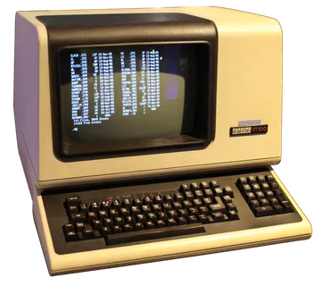
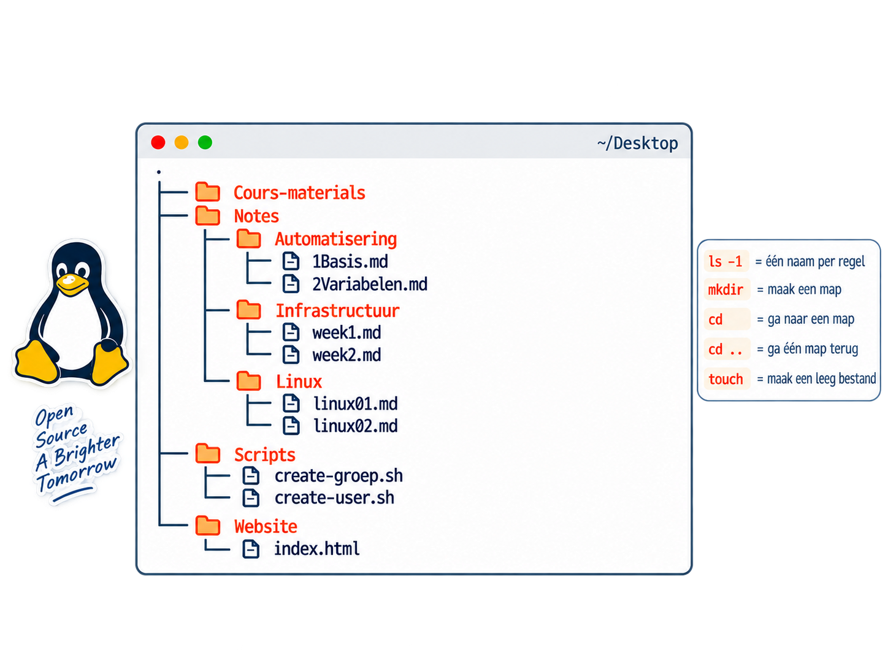

---
marp: true
theme: ubuntu
author: Pascal Thong
paginate: true
size: 16:9
---

<!-- _class: title -->
<!-- _paginate: false -->

# Les 3: Werken met de CLI

Mappen en bestanden beheren in Ubuntu

Navigeren, kopiëren & bewerken ~~zoeken en werken met beheerdersrechten.~~

---

<!-- _class: table -->

## Programma van vandaag

| Onderdeel                    | Tijd       |
| ---------------------------- | ---------- |
| Inchecken & Terugblikken     | 15 minuten |
| Terminal short-cuts          | 1 minuut   |
| Bestanden en mappen kopieren | 28 minuten |
| Nano, vi & vim?!             | 32 minuten |
| Je eigen website ontwikkelen | 30 minuten |
| Afsluitingsopdracht          | 15 minuten |

> Start je geïnstalleerde Ubuntu-VM en log in met je eigen account.

<!-- Richttijd: 75 minuten. De korte oefeningen vallen binnen de blokken.
Controleer vooraf hoe de functietoetsen in de gebruikte VMware-versie
naar de VM worden gestuurd en op welke TTY de grafische sessie draait. -->

---

## Wat ga je leren?

Na deze les kun je:

- Schakelen tussen de grafische omgeving en de tekstconsole;
- Je locatie bepalen en absolute en relatieve paden gebruiken;
- Bestanden en mappen kopiëren
- Tekstverwerken in de CLI
- Een programma installeren
- Je eigen website ontwikkelen
  ~~- sudo commando~~
  ~~- een eigen alias maken, gebruiken en verwijderen.~~

---

<!-- _class: table -->

## Terugblik: dit heb je al gedaan

Les 1: Ubuntu installeren
les 2: Ubuntu-instellingen bekijken en basiscommando's oefenen.

| Commando          | Wat doet het?                                    |
| ----------------- | ------------------------------------------------ |
| `cd` / `cd ..`    | Naar je persoonlijke map / één map omhoog.       |
| `cd /`            | Naar de hoofdmap van het bestandssysteem.        |
| `ls`              | De inhoud van een map tonen.                     |
| `ls -l` / `ls -1` | Details tonen / één naam per regel tonen.        |
| `mkdir naam`      | Een map maken.                                   |
| `touch naam.txt`  | Een leeg bestand maken als het nog niet bestaat. |

<!--
    In de vorige twee lessen hebben we VMware en Ubuntu Desktop geïnstalleerd, de instellingen van Ubuntu bekeken en basiscommando's geoefend.
-->

---

## Van GUI naar CLI, en weer terug

**GUI:** de grafische omgeving met vensters, knoppen en een muis.
**Terminal:** een CLI-venster waarin je opdrachten typt.
**TTY:** een afkorting van teletypewriter, waarmee je volledig over gaat naar de CLI

- **Ctrl + Alt + T:** opent een terminalvenster in de GUI.
- **Ctrl + Alt + F3:** schakelt naar een teletypewriter (TTY).
  **Ctrl + Alt + F2**.
- In de tekstconsole log je opnieuw in met je eigen account.
- Je grafische sessie blijft op de achtergrond draaien.



<!-- De shell, meestal Bash, interpreteert de commando's. De tekstconsole
en het terminalvenster bieden elk toegang tot een shell. -->

---

<!-- _class: demo -->

## Probeer het: de tekstconsole

1. Klik in je Ubuntu-VM en druk op **Ctrl + Alt + F3**.
2. Vul je gebruikersnaam in en druk op Enter.
3. Typ je wachtwoord en druk op Enter. Je ziet geen tekens.
4. Navigeer naar `Documents` met `cd`.
5. Maak een directory `huiswerk`.
6. Maak een bestand genaamd `mijn-configuratie.txt`
7. Typ `exit` om uit te loggen uit de tekstconsole.
8. Ga terug naar de GUI met **Ctrl + Alt + F2**.
9. Controleer of je directory en bestandje is aangemaakt.

<!-- Lees de opdracht en voer het uit. -->

---

## Waar ben ik? Gebruik pwd

`pwd` staat voor **print working directory**: toon de huidige map.

```bash
cd
pwd
```

Bijvoorbeeld: `/home/thong-thong`. Bij jou staat je eigen gebruikersnaam.

`ls` vertelt **wat er in een map staat**;
`pwd` vertelt **waar je bent**.

---

<!-- _class: table -->

## Paden: hoe wijs je een bestand en directories aan?

| Notatie      | Betekenis                   | Voorbeeld                        |
| ------------ | --------------------------- | -------------------------------- |
| Absoluut pad | Begint bij de hoofdmap `/`. | `/home/thong/Documents/huiswerk` |
| Relatief pad | Begint bij je huidige map.  | `huiswerk`                       |
| `~`          | Je eigen home-directory.    | `~/les3.txt`                     |
| `.`          | De huidige map.             | `.`                              |
| `..`         | De bovenliggende map.       | `cd ..`                          |

Linux maakt onderscheid tussen hoofdletters en kleine letters.

<!-- /home/thong is een voorbeeld, geen pad dat iedereen moet overtypen.
Bespreek: Documenten en documenten kunnen verschillende mappen zijn. -->

---

## Kopieren

### Synopsis

```bash
cp [options] ... SOURCE DESTINATION
```

```bash
cp -i note.txt ~/Documents
```

- `cp`: het commando - kopiëren
- `note.txt`: SOURCH: de bron, het bestand dat je kopieert.
- `~/Documents`: DESTINATION: het doel, het bestand waarin de kopie komt.

Wil je weten waar de -i voor staat? Voer de commando uit: `man cp`

Vermijd bestanden en directory namen met spaties.
Heb je ze? Zet dan namen met spaties tussen quotes:
`touch "mijn notities.txt"`.

---

<!-- _class: demo -->

## Bestanden kopiëren met cp (demo)

1. Bekijk het resultaat van de opdracht uit les 2.
2. Verplaats de gemaakte directories (en bestanden) naar ~/Documents

Het bronbestand blijft bestaan. Succesvol kopiëren geeft meestal geen uitvoer.



---

## Voorkom onbedoeld overschrijven

Gewoon `cp` kan een bestaand doelbestand zonder vraag overschrijven.
Gebruik `-i` als je eerst een bevestiging wilt.

```bash
cp -i note.txt ~/Documents
```

`note.txt` bestaat al. Lees de vraag en antwoord **n** om de
bestaande kopie te behouden. of **y** om de kopie over te schrijven.

Controleer vóór het kopiëren altijd de bron en het doel.

---

## Een hele map kopiëren met cp -r

`-r` betekent **recursief**: kopieer de map met alle inhoud en submappen.

```bash
cp -r ~/documenten ~/backup
```

---

<!-- _class: work -->

## Bestanden kopiëren met cp (check)

1. Bekijk het resultaat van de opdracht uit les 2 of maak het opnieuw.
   
2. Verplaats de gemaakte directories (en bestanden) naar ~/Documents
3. Verwijder de bestanden op `~/Desktop` met de commando `rm`
4. Kom je er niet uit probeer de handleiding te lezen via de commando `man rm`

> Noobs verwijderen de bestanden via de GUI.

---

## Nano

**Nano** is een teksteditor die je rechtstreeks in de terminal gebruikt.

- Je maakt en bewerkt tekstbestanden, zoals notities en configuraties.
- Je kunt meteen typen en met de pijltjestoetsen door de tekst bewegen.
- Onderaan staan de belangrijkste sneltoetsen in beeld.

**vi en vim** zijn andere teksteditors. In deze oefening gebruiken we Nano.

---

<!-- _class: demo -->

## Nano: een bestand openen of maken

1. Open met een text-bestand met `nano ~/Documents/notes/linux/week1.md`
2. Schrijf op wat je is bijgebleven vanuit les 1
3. Sla het op met ^o
4. Sluit het af met ^q
5. Bekijk je notitie met de commando `cat week1.md`
6. Herhaal stap 1 t/m 4 zelfstandig voor .../linux/week2.md
7. Maak een nieuw bestand genaamd `commandos.md`
8. Schrijf een lijst met commando's dat je kent en beschrijf de commando's. (hoe meer hoe beter).

- Bestaat het bestand al? Dan opent Nano de bestaande inhoud.
- Bestaat het nog niet? Dan begin je met een leeg bestand.

Het nieuwe bestand wordt pas op schijf aangemaakt als je het opslaat.

---

## Nano: opslaan en afsluiten

1. Druk op **Ctrl + O** om je tekst op te slaan.
2. Controleer de bestandsnaam en druk op **Enter** om te bevestigen.
3. Druk op **Ctrl + X** om Nano af te sluiten.

Onderaan in het programma staan shortcuts van het programma zoals
**`^O`** dat betekent **Ctrl + O**.

Sluit je af met niet-opgeslagen wijzigingen? Nano vraagt of je wilt opslaan.
Kies het antwoord dat onderaan staat en bevestig zo nodig de bestandsnaam.

**Ctrl + C** annuleert een vraag, bijvoorbeeld bij het opslaan.

---

<!-- _class: work -->

## Probeer het: je eigen Nano-notities

1. Open met Nano het bestand `~/les3/commandos.md`.
2. Schrijf een lijst met commando's dat je kent en beschrijf de commando's. (hoe meer hoe beter).
3. Opzoeken mag, maar je moet ze getest hebben.

---

# Nano, Vi & VIM

- Alle drie de cli-programma's zijn tekstbewerkers.
- **Nano** is de meest eenvoudige tekstbewerker en is in (bijna) alle linux distro's voorgeïnstalleerd.
- **Vi** is geadvanceerder, en is meestal voorgeïnstalleerd.
- **Vim** is het verbeterde versie en is niet altijd voorgeïnstalleerd

> het installeren doe je met de commando `sudo apt install vim`

---

## De twee modi's in Vim. (Het programma dat wij echt gaan leren)

- **Command modus**: dit is de commando modus. Je kunt commando's geven, zoals `i` of `insert` om tekst in te voegen of `:wq` om op te slaan en af te sluiten.
- **Insert modus**: in deze modus typ je tekst. Druk op **Esc** om terug te keren naar de command modus.

---

<!-- _class: demo -->

## Demonstratie: je eigen website gemaakt in vim

1. Installeer Vim met 'sudo apt install vim'
2. Open met Vim het bestand `website/index.html`.
3. Schrijf een website in html
4. Open je browser met `firefox index.html`.

```html
<html>
  <h1>Jouw naam</h1>
  <p>Korte beschrijving van jouw</p>
</html>
```

---

## De volgende commando's heb je nodig om in VIM te werken

| Commando     | Betekenis                                                                                      |
| ------------ | ---------------------------------------------------------------------------------------------- |
| `vim`        | Open een bestand in Vim, bijvoorbeeld `vim notities.txt`.                                      |
| `i`          | Ga naar de insert-modus en voeg tekst in vóór de cursor.                                       |
| `<ins>`      | Ga naar de insert-modus; met Insert wissel je tussen invoegen en overschrijven.                |
| `<esc>`      | Verlaat de insert-modus en ga terug naar de command-modus.                                     |
| `:wq!`       | Sla het bestand op en sluit Vim af; `!` forceert dit waar nodig.                               |
| `:q`         | Sluit Vim af zonder wijzigingen op te slaan.                                                   |
| `dd`         | Verwijder de huidige regel.                                                                    |
| `yy`         | Kopieer de huidige regel.                                                                      |
| `p`          | Plak de gekopieerde of verwijderde tekst na de cursor.                                         |
| `g`          | Begin van een combinatiecommando, bijvoorbeeld `gg` om naar het begin van het bestand te gaan. |
| `G`          | Ga naar het einde van het bestand.                                                             |
| `v`          | Selecteer tekst met Visual-modus.                                                              |
| `/zoekwoord` | Zoek naar `zoekwoord` in het bestand.                                                          |
| `n`          | Ga naar het volgende zoekresultaat.                                                            |

---

<!-- _class: work -->

## Maak je eigen website

1. Installeer Vim met 'sudo apt install vim'
2. Open met Vim het bestand `website/index.html`.
3. Schrijf een website in html
4. Open je browser met `firefox index.html`.

---

# Terugblik

Maak een nieuw bestand aan week3.md en schrijf daar op wat er in deze les is behandeld.

Noem iets op wat je vandaag hebt geleerd.
Hoe gevarieerder, hoe beter! :)

---

> **Disclaimer:** De volgende sheets zijn gegenereerd door AI en er heeft hier (nog) geen docent naar gekeken. Gebruik deze informatie op eigen risico.

---

## Bestanden zoeken met find

`find` doorzoekt een startmap en de mappen daaronder.

```bash
find . -name 'plan.txt'
find ~/les3 -type f -name '*.txt'
```

- `.`: begin in de huidige map.
- `-name`: zoek op naam; `*` staat voor nul of meer tekens.
- `-type f`: zoek alleen gewone bestanden.
- Quotes zorgen dat `find` zelf het zoekpatroon verwerkt.

<!-- Voer het eerste voorbeeld uit vanuit ~/les3. -name is hoofdlettergevoelig.
Bron: https://www.gnu.org/software/findutils/manual/html_node/find_html/Name.html -->

---

<!-- _class: work -->

## Opdracht 3: vind je bestanden terug

1. Ga met `cd` naar je home-directory.
2. Zoek vanuit `~/les3` alle bestanden met de naam `verslag.txt`.
3. Zoek daar alle gewone bestanden waarvan de naam eindigt op `.txt`.
4. Zoek alleen directories met `find ~/les3 -type d`.

**Tijd:** 5 minuten. **Noteer:** de gevonden paden van `verslag.txt`.

Geen resultaat? Controleer je startmap, spelling en hoofdletters.
Een langlopende zoekopdracht stop je met **Ctrl + C**.

<!-- Antwoorden:
find ~/les3 -type f -name 'verslag.txt'
find ~/les3 -type f -name '*.txt'
Verwacht verslag.txt in documenten, backup en archief.
Zoek gericht in de oefenmap; find / kan veel uitvoer en toegangsweigeringen geven. -->

---

## Beheerdersrechten: root en sudo

**root** is de superuser: het beheerdersaccount van Linux.
Sommige systeemhandelingen vereisen deze rechten.

- Zet `sudo` vóór een commando om het standaard als root uit te voeren.
- Je account moet daarvoor toestemming hebben.
- Ubuntu vraagt meestal om **je eigen wachtwoord**; je ziet geen tekens.
- Voor bestanden in je eigen oefenmap heb je geen `sudo` nodig.

`/` is de hoofdmap; **root** is een account. Dat zijn verschillende begrippen.

---

<!-- _class: demo -->

## Demonstratie: één commando met sudo

`whoami` toont onder welke gebruiker een commando draait.

```bash
whoami
sudo whoami
whoami
```

Je ziet achtereenvolgens **je eigen naam**, **root**, **je eigen naam**.

Na `sudo whoami` werk je dus verder als je gewone gebruiker.
Een recente wachtwoordcontrole kan tijdelijk onthouden worden.

<!-- Laat studenten voorspellen wat de derde opdracht toont.
sudo whoami wijzigt geen systeeminstellingen. Als een account geen sudo mag
gebruiken, laat de student meekijken bij de demonstratie.
Bron: https://manpages.ubuntu.com/manpages/noble/man8/sudo.8.html -->

---

<!-- _class: demo -->

## Een rootshell met sudo -i

`sudo -i` opent een login-shell als root. Alle volgende opdrachten
draaien daarin met beheerdersrechten. Meestal gebruik je `sudo` per commando.

```bash
sudo -i
whoami
pwd
exit
whoami
```

Je ziet als root meestal `/root`. Met `exit` keer je terug naar je eigen shell.
Controleer dat de laatste `whoami` weer je eigen gebruikersnaam toont.

<!-- Laat studenten letten op de prompt: meestal $ voor de gewone gebruiker
en # voor root, maar prompts zijn aanpasbaar. whoami is de expliciete controle.
Dit is geen directe aanmelding met een rootwachtwoord.
exit verlaat de huidige shell: in de rootshell ga je terug naar je gebruiker;
in een TTY-login-shell log je uit die tekstconsole. -->

---

## Een eigen commando maken met alias

Met `alias` geef je in Bash een eigen korte naam aan een commando.

```bash
alias overzicht='ls -l'
overzicht
alias overzicht
unalias overzicht
```

Geen spaties rond `=`. Zet het commando tussen enkele quotes.

De alias geldt in deze shell. Na sluiten verdwijnt hij; blijvend instellen
via bijvoorbeeld `~/.bashrc` valt buiten deze oefening.

---

## Een alias kan ook de computer afsluiten

Bekijk dit voorbeeld zonder het uit te voeren tijdens het oefenen:

```bash
alias fck='shutdown -h now'
```

De definitie maakt alleen de alias. Als je daarna `fck` typt,
wordt `shutdown -h now` uitgevoerd: direct afsluiten.

Een alias geeft geen extra rechten; afsluiten kan autorisatie vereisen.
Kies voor dagelijks gebruik een naam die duidelijk zegt wat er gebeurt.

<!-- Opnemen als leesvoorbeeld, niet als onderdeel van de oefenreeks.
Bron: https://www.freedesktop.org/software/systemd/man/latest/shutdown.html -->

---

<!-- _class: work -->

## Opdracht 4: je eigen afkorting

1. Controleer met `whoami` dat je als je eigen gebruiker werkt.
2. Maak de alias `naarles` voor `cd ~/les3`.
3. Ga met `cd /` naar de hoofdmap.
4. Voer `naarles` uit en controleer je locatie met `pwd`.
5. Bekijk de definitie met `alias naarles`.
6. Verwijder de alias met `unalias naarles`.

**Tijd:** 3 minuten. Leg aan je buur uit waarom quotes nodig zijn.

<!-- Antwoord: alias naarles='cd ~/les3'
De quotes houden de volledige vervangende tekst, inclusief spatie, bij elkaar.
Na unalias is naarles niet meer als deze alias beschikbaar. -->

---

<!-- _class: table -->

## Als een commando niet werkt

| Melding of situatie         | Wat controleer je?                                   |
| --------------------------- | ---------------------------------------------------- |
| `No such file or directory` | Je locatie met pwd; namen en paden met ls.           |
| `Permission denied`         | Mag jouw account hier werken? Is dit het juiste pad? |
| `omitting directory` bij cp | Voor een map met inhoud heb je -r nodig.             |
| find geeft geen resultaat   | Startmap, hoofdletters en zoekpatroon.               |
| Een alias werkt niet meer   | Zit je nog in dezelfde shell?                        |

Lees de melding. Voeg `sudo` pas toe als beheerdersrechten echt nodig zijn.

---

<!-- _class: work -->

## Eindopdracht: zelfstandig aan de slag

Maak vanuit `~/les3` een nieuwe map `eindopdracht`.

1. Maak daarin `bron` en `kopie`, met `uitleg.txt` in `bron`.
2. Kopieer het bestand naar `kopie` en de map `bron` naar `reserve`.
3. Zoek binnen `eindopdracht` alle bestanden met de naam `uitleg.txt`.
4. Maak en test de alias `zoekuitleg` voor die zoekopdracht. Leg de definitie en uitvoer vast.
5. Verwijder de alias. Controleer met `whoami` je gebruikersnaam.

**Tijd:** 10 minuten. Gebruik je notities en werk als je eigen gebruiker.

<!-- Mogelijke uitwerking:
cd ~/les3
mkdir eindopdracht
cd eindopdracht
mkdir bron kopie
touch bron/uitleg.txt
cp bron/uitleg.txt kopie/
cp -r bron reserve
find . -type f -name 'uitleg.txt'
alias zoekuitleg='find ~/les3/eindopdracht -type f -name uitleg.txt'
zoekuitleg
unalias zoekuitleg
whoami
Drie gevonden bestanden: bron/uitleg.txt, kopie/uitleg.txt, reserve/uitleg.txt.
Een exacte naam zonder spaties of wildcards heeft hier geen extra quotes nodig. -->

---

## Wat lever je op?

Vul je Markdown-notities in **Notes/Linux** aan met:

- een screenshot van `pwd` en de drie gevonden paden uit de eindopdracht;
- de definitie van `zoekuitleg` en het resultaat van de alias;
- in je eigen woorden het verschil tussen `cp -r` en `cp -d`;
- wanneer je `sudo` nodig hebt en hoe je een rootshell verlaat.

**Geslaagd:** de drie bestanden bestaan, de alias werkt en je kunt
uitleggen welke commando's je hebt gebruikt.

<!-- Laat studenten de aliasdefinitie tijdens stap 4 vastleggen, bijvoorbeeld
met alias zoekuitleg, voordat ze de alias weer verwijderen. -->

---

<!-- _class: recap -->

## Terugblik

- Wat is het verschil tussen `pwd` en `ls`?
- Welke optie heb je nodig om een hele map te kopiëren?
- Wat betekent de punt in `find . -name '*.txt'`?
- Wat is het verschil tussen `sudo commando` en `sudo -i`?
- Blijft een alias bestaan als je deze terminal sluit?

**Volgende les:** gebruikers, groepen en rechten.
Wie mag welke bestanden lezen, wijzigen en uitvoeren?

<!-- Antwoorden: locatie versus inhoud; cp -r; zoeken vanaf de huidige map;
één opdracht als root versus een blijvende rootshell; nee, niet zonder configuratie.
Docentbronnen:
https://www.gnu.org/software/coreutils/manual/html_node/cp-invocation.html
https://www.gnu.org/software/findutils/manual/html_node/find_html/Name.html
https://www.gnu.org/software/bash/manual/html_node/Aliases.html
https://manpages.ubuntu.com/manpages/noble/man8/sudo.8.html
-->
