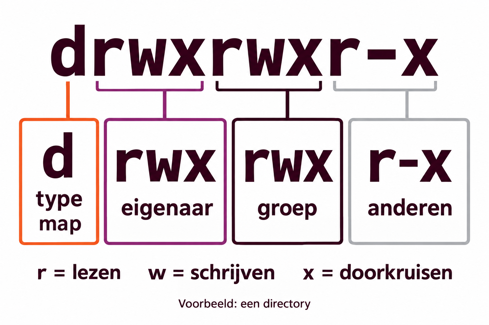

---
marp: true
theme: ubuntu
author: Pascal Thong
lang: nl
paginate: true
size: 16:9
class: linux04
---

<!-- _class: linux04 title -->
<!-- _paginate: false -->

# Les 4: Gebruikers,<br>groepen en rechten

Wie ben je? Waar hoor je bij? Wat mag je doen?

Linux · Ubuntu · System Engineering

---

## Programma van vandaag

### Nieuw Theorie

1. Gebruikers, groepen en root begrijpen.
2. Accounts aanmaken en groepsleden beheren.
3. Eigenaarschap en `rwx`-rechten lezen.

> Start je Ubuntu-VM. Log in met je eigen account en open de terminal met **Ctrl + Alt + T**.

---

<!-- _class: linux04 question -->

## Eén computer, meerdere gebruikers

Je deelt een Linux-computer met anderen

- Iedereen wil een eigen home-map en eigen instellingen.
- Jullie willen samen aan een project werken.
- Andere gebruikers mogen jullie project niet openen.

**Hoe regel je dat zonder iedereen beheerder te maken?**

<!--  -->

---

## Wat is een gebruiker?

Een **gebruikersaccount** is een identiteit op het systeem.
Ook processen draaien onder een gebruikersidentiteit.

- Een **persoonlijk account**: voor iemand die inlogt en werkt.
- Een **systeemaccount**: voor een dienst, zoals een webserver.
- Een **UID** (_user ID_): het nummer waarmee Linux de gebruiker herkent.

Geef een persoonlijk account een home-map, zoals `/home/zusje`.
Systeemaccounts hebben vaak geen gewone home-map of inlogshell.

---

## Root, sudo en je eigen account

- **root** is de beheerder met **UID 0**.
- Gewone accounts hebben beperkte rechten.
- Met **sudo** mag een bevoegd account een opdracht als root uitvoeren.
- Het eerste gebruikersaccount in Ubuntu-account heeft meestal UID **1000**.

```bash
whoami
id
```

> Werk met je eigen account. Gebruik `sudo` voor beheeropdrachten.

---

## Wat is een groep?

Een **groep** bundelt gebruikers die dezelfde toegang nodig hebben.

- Elke groep heeft een **GID** (_group ID_).
- Een gebruiker heeft één **primaire groep** en kan extra groepen hebben.
- Voorbeelden: een projectteam, een afdeling of beheerders.
- Gewone groepen beginnen op Ubuntu meestal bij GID **1000**;
  systeemgroepen kunnen lagere nummers hebben.

**Een groep maakt samenwerken en rechten beheren eenvoudiger.**

---

<!-- _class: linux04 table -->

## Waar staan lokale accounts?

| Bestand       | Wat staat erin?                                           |
| ------------- | --------------------------------------------------------- |
| `/etc/passwd` | Gebruikersnaam, UID, GID, home-map en shell.              |
| `/etc/shadow` | Wachtwoordhashes en informatie over wachtwoordgeldigheid. |
| `/etc/group`  | Groepsnamen, GID's en aanvullende groepsleden.            |

Een **hash** is geen leesbaar of terug te ontsleutelen wachtwoord.
`/etc/shadow` is daarom alleen voor bevoegde accounts leesbaar.

> Bekijk de gegevens; wijzig accounts met beheercommando's.

---

<!-- _class: linux04 table compact -->

## cat /etc/passwd

``Met `cat /etc/passwd`zie je de accounts.`:` scheidt de zeven velden.

```text
pascal-thong:x:1000:1000:Pascal Thong:/home/pascal-thong:/bin/bash
```

| Veld           | Voorbeeld            | Betekenis                       |
| -------------- | -------------------- | ------------------------------- |
| Gebruikersnaam | `pascal-thong`       | Naam van het account.           |
| Wachtwoordveld | `x`                  | De hash staat in `/etc/shadow`. |
| UID            | `1000`               | Nummer van de gebruiker.        |
| GID            | `1000`               | Nummer van de primaire groep.   |
| Home-map       | `/home/pascal-thong` | Persoonlijke map.               |
| Shell          | `/bin/bash`          | Programma voor de tekstlogin.   |

--

## cat /etc/group

```bash
cat /etc/group
```

```text
project:x:1003:piet,jan
```

**groepsnaam : wachtwoordveld : GID : aanvullende leden**

- `project` is de groepsnaam; `1003` is hier het GID.
- `zusje,broer` zijn aanvullende leden van de groep.
- Een gebruiker met deze **primaire groep** hoeft hier niet bij te staan.

Controleer alle groepen van een gebruiker met `id gebruikersnaam`.

---

<!-- _class: linux04 demo -->

## Een gebruiker maken: useradd

Voer de beheeropdrachten uit met je eigen sudo-account.
Gebruik nieuwe oefenaccounts in je Ubuntu-VM.

```bash
sudo useradd -m zus
sudo passwd zus
id zusje
ls /home
```

- `-m`: maak ook een home-map.
- `passwd zus`: stel het wachtwoord voor dit account in.

---

## Wachtwoorden en wisselen van gebruiker

```bash
su - zus
whoami
pwd
exit
```

- `su - zus`: start login voor **zus**.
- Typ het wachtwoord voor **zus**; je ziet geen tekens.
- `-` laadt de loginomgeving en gaat naar haar home-map.
- `exit`: keer terug naar je vorige shell.

Met `passwd` wijzig je je eigen wachtwoord.
`su -` zonder naam probeert naar **root** te wisselen.

<!-- Ubuntu heeft standaard een vergrendeld rootwachtwoord. su - werkt daardoor meestal niet voor root; stel hiervoor geen rootwachtwoord in. Gebruik sudo voor de beheeropdrachten. -->

---

<!-- _class: linux04 demo -->

## Een groep maken en leden toevoegen

Terug in je eigen account:

```bash
sudo useradd -m broer
sudo passwd broer
sudo groupadd project
sudo usermod -aG project broer
sudo usermod -aG project broer
```

`-G` kiest aanvullende groepen; **`-a` voegt toe**.
Zonder `-a` vervang je de bestaande aanvullende groepslidmaatschappen.

> Nieuwe groepsrechten gelden in een nieuwe login-sessie.

---

## Een groepslid verwijderen

```bash
sudo gpasswd -d broer project
```

Dit verwijdert **broer** als aanvullend lid van **project**.
Het account en zijn bestanden blijven bestaan.

Voeg hem voor de volgende oefening weer toe:

```bash
sudo usermod -aG project broer
```

---

<!-- _class: linux04 section -->

# Van identiteit naar rechten

Een account zegt **wie** je bent.
Rechten bepalen **wat** je mag doen.

---

## Wat betekent eigenaar zijn?

Elk bestand en elke map heeft **één gebruiker als eigenaar**
en **één groep** waaraan het object is gekoppeld.

- De eigenaar kan doorgaans de toegangsrechten wijzigen.
- De groep maakt gedeelde toegang mogelijk.
- Rechten bestaan voor **eigenaar**, **groep** en **anderen**.
- Eigenaar zijn betekent niet automatisch dat alle `rwx`-rechten aanstaan.

> Een map is een zelfstandig object. Bestanden erin kunnen andere eigenaars en rechten hebben.

---

## Rechten bekijken met ls

```bash
ls -la ~/Documents
ls -ld ~/Documents/note.txt
```

Voorbeeld van een detailregel, zodra de oefenmap bestaat:

```text
drwxrwxr-x 2 zus project 4096 sep 30 10:00 les4
```

- `-l`: lange weergave met rechten, eigenaar en groep.
- `-a`: toon ook verborgen namen, waaronder `.` en `..`.
- `-d`: toon de **map zelf**, in plaats van de inhoud.
- `zus` is de eigenaar; `project` is de groep.

---

<!-- _class: linux04 visual -->

## Rechten lezen



Een streepje betekent: dit recht staat uit. `-` als **eerste** teken is een gewoon bestand.

---

<!-- _class: linux04 table -->

## r, w en x: bestand of map?

| Recht           | Op een bestand           | Op een map (directory)                                            |
| --------------- | ------------------------ | ----------------------------------------------------------------- |
| **r** · read    | Inhoud lezen.            | Bestandsnamen in de map opvragen.                                 |
| **w** · write   | Inhoud wijzigen.         | Namen toevoegen, verwijderen of hernoemen; meestal ook `x` nodig. |
| **x** · execute | Als programma uitvoeren. | De map doorzoeken/doorkruisen, bijvoorbeeld met `cd`.             |

Om een bestand via zijn pad te bereiken, heb je `x` nodig op de bovenliggende mappen.

**Een bestand verwijderen hangt vooral af van de rechten op de map.**

<!-- Verwijderen vereist normaal w en x op de bovenliggende map. Sticky bit, ACL's en andere beperkingen vallen buiten deze basisles. Een uitvoerbaar bestand moet daarnaast een geldig programma of script zijn. -->
